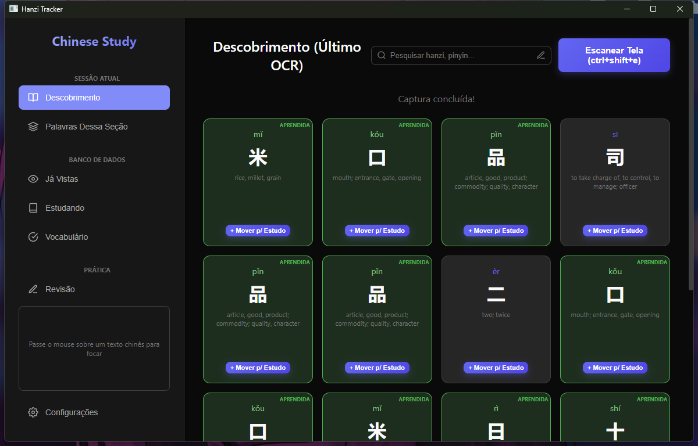
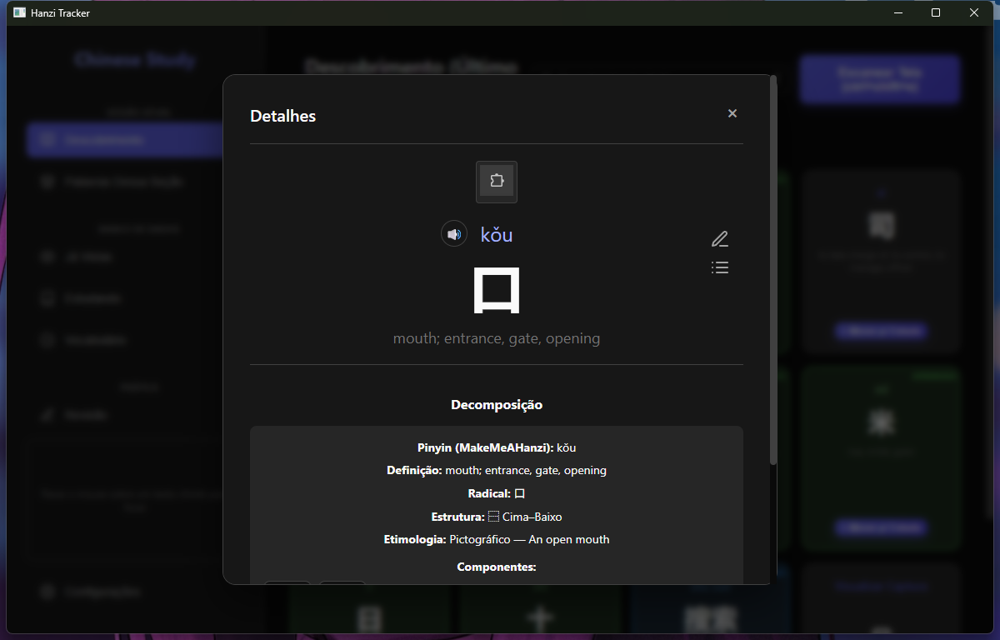
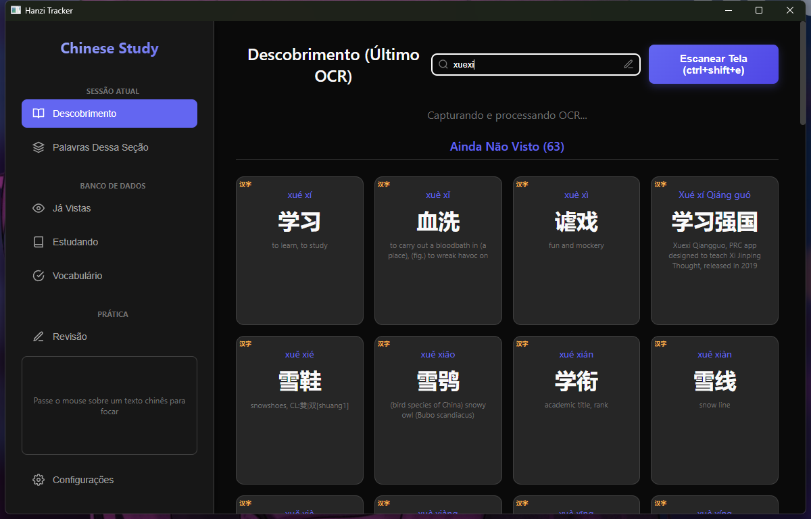
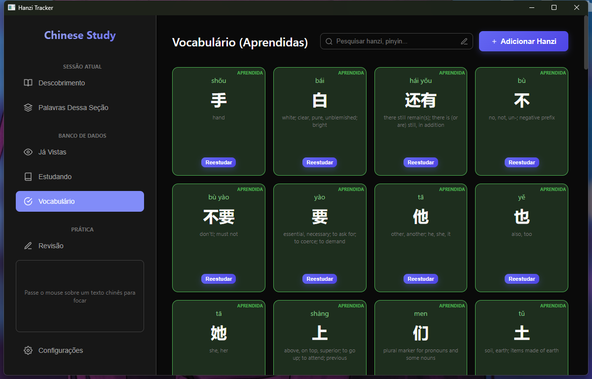
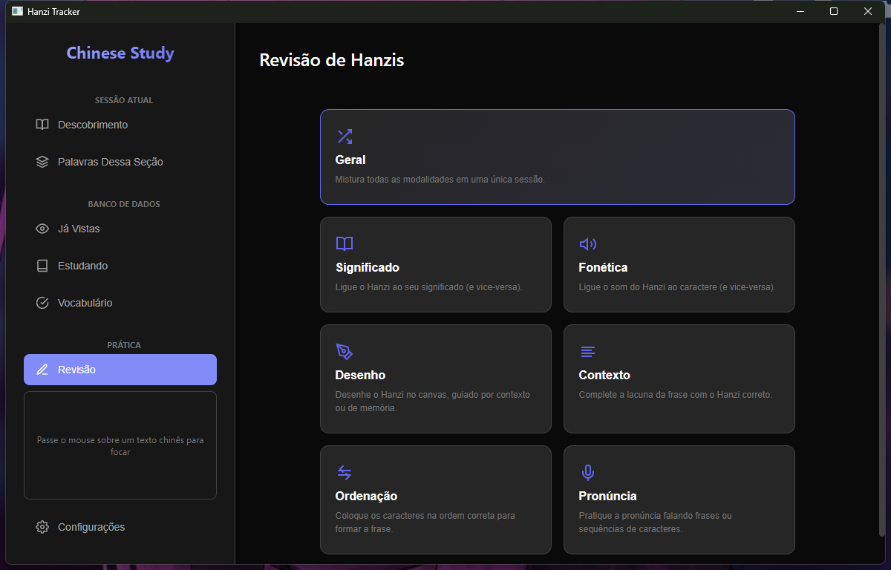
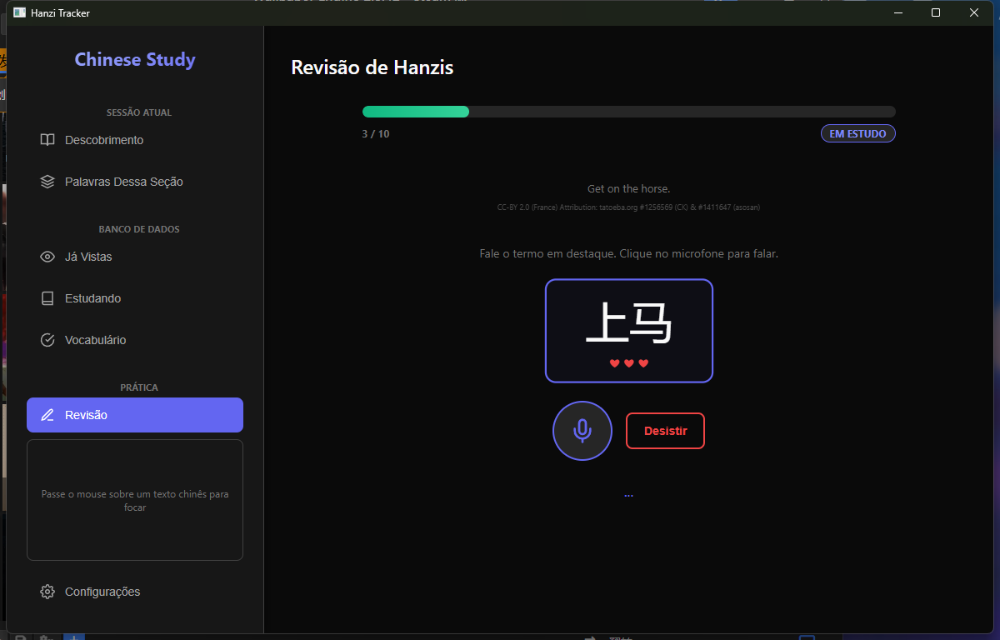
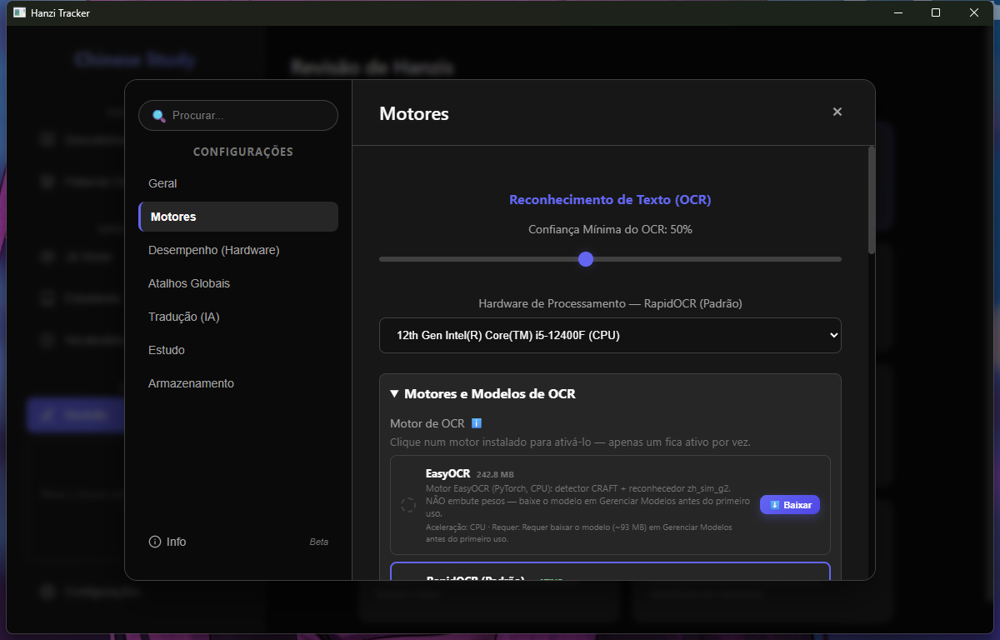
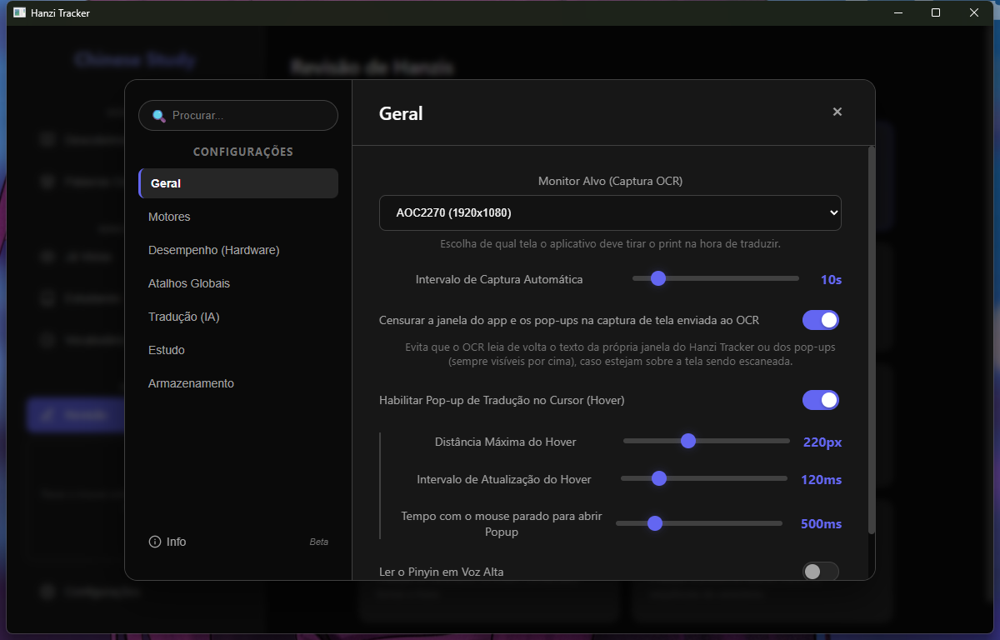

# Hanzi Tracker

[](https://github.com/Donklii/Hanzi-Tracker/releases)
[](LICENSE)
[](#como-obter-usuário-final)

**Aplicativo desktop flutuante que captura texto chinês na tela, executa OCR, segmenta as palavras e
exibe pinyin (com tons), significados e a dissecação dos Hanzis em tempo real** — pensado para estudar
chinês enquanto você joga, assiste a algo ou lê qualquer coisa em 中文.



O backend principal e a interface são **Go + React (via Wails)**; os motores de OCR, síntese de voz e
reconhecimento de fala rodam como microserviços Python próprios, baixados sob demanda (ver
[Motores](#motores-de-ocr-voz-e-escuta-baixados-sob-demanda)) — você não precisa instalar Python para
usar o app.

## Índice

- [Como obter (usuário final)](#como-obter-usuário-final)
- [Funcionalidades](#funcionalidades)
- [Motores de OCR, voz e escuta (baixados sob demanda)](#motores-de-ocr-voz-e-escuta-baixados-sob-demanda)
- [Requisitos (desenvolvimento)](#requisitos-desenvolvimento)
- [Como Executar (Desenvolvimento e Uso Diário)](#como-executar-desenvolvimento-e-uso-diário)
- [Como Compilar o App (Build)](#como-compilar-o-app-build)
- [Onde os dados ficam](#onde-os-dados-ficam)
- [Documentação adicional](#documentação-adicional)

## Como obter (usuário final)

**Não quer compilar nada?** Baixe o instalador e comece a usar em minutos.

A forma mais simples é baixar o **instalador Windows** nas
[GitHub Releases](../../releases) deste repositório — não exige Go, Node nem Python instalados.
Durante a instalação você escolhe qual motor de OCR (e, opcionalmente, de voz) usar; o app baixa
esse motor sozinho na primeira abertura. Veja [docs/PUBLICAR-APP.md](docs/PUBLICAR-APP.md) para como
o instalador é gerado e publicado.

Também há um pacote **Linux (.deb)** nas mesmas releases (Ubuntu 24.04+/Debian 13+, sessão X11
recomendada):

```bash
sudo apt install ./hanzitracker_<versão>_amd64.deb
```

No Linux os motores disponíveis são RapidOCR e EasyOCR (CPU) + Kokoro e ChatTTS para voz e
Paraformer-ZH para reconhecimento de fala — o Tesseract é Windows-only. Detalhes e limitações em
[docs/PUBLICAR-APP.md](docs/PUBLICAR-APP.md#o-pacote-linux-deb).

> O restante deste documento cobre como rodar e compilar o projeto **a partir do código-fonte** (para
> desenvolvimento). Se você só quer usar o app, o instalador acima já é tudo que você precisa.

## Funcionalidades

### Captura e tradução em tempo real

- **Pipeline em tempo real:** captura de tela (Go) → OCR (Python via HTTP) → segmentação (Go/Jieba) → dicionário (Go/CC-CEDICT) → UI (React).
- **Pinyin com tons:** converte o pinyin numerado do CC-CEDICT (`Zhong1 guo2`) para acentos (`Zhōngguó`).
- **Tradução sob o mouse:** um pop-up hover mostra em tempo real a palavra chinesa mais próxima do cursor na tela.
- **Mostrar pop-up de tudo:** um atalho global exibe simultaneamente os pop-ups de **todas** as palavras detectadas sobre a tela (toggle: aperte de novo para esconder), reposicionando-se automaticamente para não se sobrepor.
- **Tradução de linha (opcional):** em vez de pinyin/significado por palavra, traduz cada linha OCR inteira via Google Cloud Translation (chave própria do usuário) ou via Gemini — que também pode gerar um **resumo da tela**, opcionalmente enviando a captura. Traduções são cacheadas em SQLite para não repetir custo de API.

### Dicionário e dissecação de Hanzis



Usando dados do **MakeMeAHanzi**, qualquer caractere pode ser clicado para ver sua **etimologia,
radical, estrutura de composição e animação dos traços**, com redirecionamento automático de
abreviações visuais para os hanzis completos originais.

### Busca global



Um campo de busca consulta hanzi, pinyin ou significado em todo o CC-CEDICT + MakeMeAHanzi de uma vez
— útil mesmo sem nenhuma captura de tela na sessão.

### Vocabulário e progresso



Marque cada hanzi como **em estudo** (azul) ou **aprendido** (verde). O status é salvo em um banco
SQLite e persiste entre sessões, populando também o histórico ("Já Vistas", com barra de progresso
sobre o dicionário inteiro).

### Revisão e prática gamificada



Sete modos de prática, sorteando entre as palavras marcadas como "em estudo" e o dicionário geral, com
uma camada de gamificação estilo Duolingo (sequência de acertos, pontos, elogios e efeitos sonoros):

- **Geral** — mistura todas as modalidades abaixo em uma única sessão.
- **Significado** — liga o hanzi ao seu significado (e vice-versa).
- **Fonética** — liga o som do hanzi ao caractere (e vice-versa), via TTS.
- **Desenho** — trace o hanzi num canvas, guiado por contexto ou de memória.
- **Contexto** — complete a lacuna de uma frase real do Tatoeba com o hanzi correto.
- **Ordenação** — arraste os caracteres na ordem certa para reconstruir a frase.
- **Pronúncia** — fale o termo ou a frase em voz alta; o app transcreve com um motor de reconhecimento de fala e valida sílaba a sílaba, com direito a "vidas" e feedback em tempo real.



### Voz: leitura e reconhecimento de fala

- **Leitura em voz alta (TTS):** lê o hanzi de qualquer cartão usando um motor de voz local — **Kokoro-82M** (leve) ou **ChatTTS** (mais natural e pesado) — baixado sob demanda. Os áudios ficam em cache por pronúncia (não por hanzi: homófonos compartilham o mesmo áudio), então leituras repetidas saem instantâneas.
- **Reconhecimento de fala (STT):** o modo Pronúncia usa o motor local **Paraformer-ZH** (também baixado sob demanda) para transcrever o que você fala e comparar com o pinyin alvo.

### Sincronização e backup na nuvem

Conecte sua conta do **Google Drive** (OAuth) para manter o progresso sincronizado entre computadores.
Na primeira conexão, se já existir um backup na nuvem, você escolhe entre manter o banco local ou o da
nuvem. Tudo é gerenciável pela aba **Armazenamento** das configurações, junto com o uso de disco por
categoria (motores, modelos, banco, cache de tradução/voz) e opções para limpar itens individuais ou
excluir tudo.

### Motores selecionáveis e configurações avançadas



- **Motores de OCR selecionáveis:** RapidOCR (padrão, leve, com aceleração WebGPU em qualquer GPU), Tesseract (CPU) e EasyOCR (CPU) — troque de motor a qualquer momento pela interface; cada um baixa seus próprios pesos sob demanda.
- **Compatibilidade hardware × modelo:** ao escolher um modelo, as opções de hardware/aceleração incompatíveis são desabilitadas (com tooltip explicando o motivo). Se o modelo selecionado não suportar o hardware atual, a configuração migra automaticamente para uma combinação suportada e um aviso é exibido.
- **Qualidade da imagem (OCR):** controle para reduzir a resolução enviada ao OCR (mantendo a proporção do monitor), equilibrando precisão e uso de CPU/GPU.



- **Configurações avançadas:** interface rica (estilo Claude Desktop) para editar todas as constantes: hardware de IA (CPU vs GPU via WebGPU), pausa por limite de uso, threads, atalhos globais, monitor alvo da captura, etc. Tudo salvo dinamicamente no `AppData`.

## Motores de OCR, voz e escuta (baixados sob demanda)

Os motores de OCR (RapidOCR, Tesseract, EasyOCR), de voz (Kokoro-82M, ChatTTS) e de escuta
(Paraformer-ZH) são microserviços Python **congelados** (PyInstaller), publicados como `.zip` nas
[GitHub Releases](../../releases) deste repositório e baixados pelo próprio app para
`%APPDATA%\HanziTracker\motores_ocr\`/`motores_tts\`/`motores_stt\` — não é necessário Python instalado
para usar o app (nem em produção, nem rodando `go run .` a partir do código-fonte). No primeiro start
sem nenhum motor de OCR instalado, o app baixa e ativa o RapidOCR sozinho (ou o motor escolhido no
instalador, se você usou um). Veja [docs/PUBLICAR-MOTORES.md](docs/PUBLICAR-MOTORES.md) para os
detalhes.

## Requisitos (desenvolvimento)

- **Go** 1.25+
- **Node.js** (npm) para o Frontend Vite/React — instalado automaticamente pelo Wails a cada build/dev.
- **Wails CLI** (`go install github.com/wailsapp/wails/v2/cmd/wails@latest`).
- Arquivos de Dicionário em `wails_app/dicionario/`:
  - `cedict_ts.u8` (CC-CEDICT)
  - `makemeahanzi_dictionary.txt` (MakeMeAHanzi)

> **Python só é necessário se você for mexer no código dos motores** (`python_backend/`) ou recongelar
> os sidecars para publicar uma nova versão (ver [docs/BUILD.md](docs/BUILD.md) e
> [docs/PUBLICAR-MOTORES.md](docs/PUBLICAR-MOTORES.md)). Para simplesmente rodar/desenvolver o app,
> `go run .` já baixa e sobe o motor de OCR sozinho, exatamente como no app distribuído.

## Como Executar (Desenvolvimento e Uso Diário)

A maneira mais fácil de rodar o aplicativo de ponta a ponta é usando o script inicializador na raiz:

```bash
go run .
```

**O que este comando faz?**
1. Compila o frontend (Vite/React) automaticamente, se necessário.
2. Reserva uma porta local para o motor de OCR e a pasta de dados (`%APPDATA%\HanziTracker`), repassadas por variável de ambiente.
3. Procura pelo executável final compilado do Wails na pasta `wails_app/build/bin/HanziTracker.exe`.
4. Se encontrar, abre o executável. Se não, executa a aplicação Wails em modo fonte (`go run .` dentro de `wails_app`).
5. O **próprio app Wails** (não mais este orquestrador) sobe/derruba o motor de OCR: se nenhum motor estiver instalado, ele baixa e ativa o RapidOCR sozinho (first-run) — sem precisar de Python/pip instalados localmente.
6. Ao fechar a janela do aplicativo (ou com `Ctrl+C` no terminal), encerra automaticamente toda a árvore de processos (Wails + motor de OCR/voz) para evitar vazamento de memória.

### Modo de desenvolvimento do frontend

Para iterar no frontend com *hot reload* (sem recompilar o executável a cada alteração), use:

```bash
go run . dev
```

Isso abre a aplicação via `wails dev`, recarregando a UI automaticamente conforme você edita o React.

## Como Compilar o App (Build)

Sempre que você alterar o código-fonte (seja no backend em Go dentro de `wails_app/` ou no frontend em
React dentro de `wails_app/frontend/src/`), o executável final não se atualizará sozinho. Para injetar
e compilar as novas alterações (ou os novos designs visuais), execute:

```bash
cd wails_app
wails build
```

Isso fará o Wails orquestrar o `npm run build` do frontend em Vite, embutir os recursos (`//go:embed`)
e compilar um binário estático e de alta performance (`HanziTracker.exe`). Após isso, voltar a executar
o `go run main.go` da raiz abrirá a sua versão atualizada.

Para gerar o **instalador Windows** (NSIS, com a tela de escolha de motor) em vez do `.exe` solto, veja
[docs/PUBLICAR-APP.md](docs/PUBLICAR-APP.md) — normalmente isso é feito pela CI a cada push/release,
não manualmente.

## Onde os dados ficam

O status de estudo, configurações, motores e caches ficam persistidos automaticamente pelo Go no
diretório AppData do Windows do usuário logado:

```
%APPDATA%\HanziTracker\progresso.db               ← vocabulário + cache de tradução e de áudio TTS (SQLite)
%APPDATA%\HanziTracker\configuracoes.json          ← configurações alteradas via UI
%APPDATA%\HanziTracker\motores_ocr\<Motor>\        ← sidecar de OCR baixado (.exe + pesos em modelos\)
%APPDATA%\HanziTracker\motores_tts\<Motor>\        ← sidecar de voz baixado (.exe + pesos do Hugging Face)
%APPDATA%\HanziTracker\motores_stt\<Motor>\        ← sidecar de escuta baixado (.exe + pesos do Hugging Face)
```

> **Nota técnica:** o download/remoção dos motores é feito pelo **Go**, e não pelo Python. Em
> desenvolvimento, o interpretador Python (quando usado para mexer nos sidecars) costuma vir da
> Microsoft Store, que roda num sandbox e virtualiza as **escritas** em `AppData` para um diretório
> próprio — então o Python apenas **lê** os dados nesse caminho real, enquanto o Go (processo normal)
> escreve nele. No app distribuído (Python congelado, sem sandbox) essa distinção não existe.

## Documentação adicional

Guias mais técnicos, para quem for mexer no build ou nos motores:

- [docs/BUILD.md](docs/BUILD.md) — como compilar e recongelar os sidecars Python.
- [docs/PUBLICAR-APP.md](docs/PUBLICAR-APP.md) — como o instalador Windows e o pacote Linux são gerados e publicados.
- [docs/PUBLICAR-MOTORES.md](docs/PUBLICAR-MOTORES.md) — como os motores de OCR/voz/escuta são publicados e versionados.
- [docs/CONTRATO-OCR.md](docs/CONTRATO-OCR.md), [docs/CONTRATO-TTS.md](docs/CONTRATO-TTS.md), [docs/CONTRATO-STT.md](docs/CONTRATO-STT.md) — o contrato HTTP que cada microserviço Python precisa respeitar.
